# Steps to setup the project and execute
- Install and setup Mysql on local and create a database say - "gst_billing_system"
- clone the repository
- Open any IDE(IntelliJ or STS) and select open project.Select the folder backend.
- Make sure Java and Maven are installed on the machine.
- In application.properties do below
    - replace {your_database_name} by the name of the database created in step 2
    - replace {your_password} by the password added while setting up mysql
    - replace {your_secret_key} by any of your choice say - charan3972
    - replace {your_admin_password} by any of your choice say - SaiCharan@8688011464
    - replace {your_frontend_base_url} by any of your choice say - http://localhost:3000
- Open terminal , go to directory backend
- Run the command - mvn clean install
- Post successful build, run the main file - GSTBillingApplication , server starts on port 8085
- Open VS code
- select folder frontend
- Open terminal and run the command - http-server -p 3000 , server starts on port 3000
- Open http://localhost:3000/index.html
- Now we can login as admin or user and do the operations.
- To login as user , first login as admin and add user and then use those creds to login as user.
- Admin can add user,add category,add product,view sales,view revenue
- User can only record sale and view bill

# tables with sample data
## users
<table border="1">
  <thead>
    <tr>
      <th>id</th>
      <th>password</th>
      <th>username</th>
    </tr>
  </thead>
  <tbody>
    <tr>
      <td>1</td>
      <td>$2a$10$qYqmZadpjXFL2B0cQxUOXO/h0.RQa3UL8Y3ldS.RFRi9diLVrDTWa</td>
      <td>admin</td>
    </tr>
    <tr>
      <td>2</td>
      <td>$2a$10$Std4mq3CxxRuztBLB90vmeCZ46fVH62h5dqSJyKOdBw/6KQqz0Ow2</td>
      <td>user1</td>
    </tr>
    <tr>
      <td>3</td>
      <td>$2a$10$SDb8gPE3REX07QcxXlxds.Vxh.rNzGjcZSfHgdKMtJY.XWtL9rhwa</td>
      <td>user3</td>
    </tr>
    <tr>
      <td>4</td>
      <td>$2a$10$5KmZ4ORhyk0nkg7TzlgnBOpcyi2Vhfv80Wz0pUF0sFj6A6ziO3S..</td>
      <td>user2</td>
    </tr>
    <tr>
      <td>5</td>
      <td>$2a$10$BE2uZRsEdgBXLjQJSc2p/ejBrnqDL65XADLW5L/AyzNzCz3Vi0A/C</td>
      <td>user4</td>
    </tr>
  </tbody>
</table>

## user_roles
<table border="1">
  <thead>
    <tr>
      <th>user_id</th>
      <th>role</th>
    </tr>
  </thead>
  <tbody>
    <tr>
      <td>1</td>
      <td>ADMIN</td>
    </tr>
    <tr>
      <td>2</td>
      <td>USER</td>
    </tr>
    <tr>
      <td>3</td>
      <td>USER</td>
    </tr>
    <tr>
      <td>4</td>
      <td>USER</td>
    </tr>
    <tr>
      <td>5</td>
      <td>USER</td>
    </tr>
  </tbody>
</table>

## product_category
<table border="1">
  <thead>
    <tr>
      <th>id</th>
      <th>gst_rate</th>
      <th>name</th>
    </tr>
  </thead>
  <tbody>
    <tr>
      <td>1</td>
      <td>5</td>
      <td>Food</td>
    </tr>
    <tr>
      <td>2</td>
      <td>10</td>
      <td>Footwear</td>
    </tr>
    <tr>
      <td>3</td>
      <td>20</td>
      <td>Electronics</td>
    </tr>
  </tbody>
</table>

## product
<table border="1">
  <thead>
    <tr>
      <th>id</th>
      <th>name</th>
      <th>price</th>
      <th>category_id</th>
    </tr>
  </thead>
  <tbody>
    <tr>
      <td>1</td>
      <td>Mobile</td>
      <td>20000</td>
      <td>3</td>
    </tr>
    <tr>
      <td>2</td>
      <td>Laptop</td>
      <td>50000</td>
      <td>3</td>
    </tr>
    <tr>
      <td>3</td>
      <td>1kgRice</td>
      <td>50</td>
      <td>1</td>
    </tr>
    <tr>
      <td>4</td>
      <td>Sandals</td>
      <td>1000</td>
      <td>2</td>
    </tr>
  </tbody>
</table>

## sale
<table border="1">
  <thead>
    <tr>
      <th>id</th>
      <th>sale_date</th>
      <th>tax_amount</th>
      <th>total_amount</th>
    </tr>
  </thead>
  <tbody>
    <tr>
      <td>1</td>
      <td>2024-09-09</td>
      <td>24407.5</td>
      <td>148557.5</td>
    </tr>
    <tr>
      <td>2</td>
      <td>2024-09-09</td>
      <td>14000</td>
      <td>84000</td>
    </tr>
    <tr>
      <td>3</td>
      <td>2024-09-09</td>
      <td>8000</td>
      <td>48000</td>
    </tr>
    <tr>
      <td>4</td>
      <td>2024-09-09</td>
      <td>8000</td>
      <td>48000</td>
    </tr>
    <tr>
      <td>5</td>
      <td>2024-09-09</td>
      <td>8300</td>
      <td>51300</td>
    </tr>
    <tr>
      <td>6</td>
      <td>2024-09-09</td>
      <td>4007.5</td>
      <td>24157.5</td>
    </tr>
    <tr>
      <td>7</td>
      <td>2024-09-09</td>
      <td>20000</td>
      <td>120000</td>
    </tr>
    <tr>
      <td>8</td>
      <td>2024-09-09</td>
      <td>28000</td>
      <td>168000</td>
    </tr>
  </tbody>
</table>

## sale_item
<table border="1">
  <thead>
    <tr>
      <th>id</th>
      <th>quantity</th>
      <th>tax_amount</th>
      <th>total_amount</th>
      <th>product_id</th>
      <th>sale_id</th>
    </tr>
  </thead>
  <tbody>
    <tr>
      <td>1</td>
      <td>1</td>
      <td>4000</td>
      <td>24000</td>
      <td>1</td>
      <td>1</td>
    </tr>
    <tr>
      <td>2</td>
      <td>2</td>
      <td>20000</td>
      <td>120000</td>
      <td>2</td>
      <td>1</td>
    </tr>
    <tr>
      <td>3</td>
      <td>3</td>
      <td>7.5</td>
      <td>157.5</td>
      <td>3</td>
      <td>1</td>
    </tr>
    <tr>
      <td>4</td>
      <td>4</td>
      <td>400</td>
      <td>4400</td>
      <td>4</td>
      <td>1</td>
    </tr>
    <tr>
      <td>5</td>
      <td>1</td>
      <td>4000</td>
      <td>24000</td>
      <td>1</td>
      <td>2</td>
    </tr>
    <tr>
      <td>6</td>
      <td>1</td>
      <td>10000</td>
      <td>60000</td>
      <td>2</td>
      <td>2</td>
    </tr>
    <tr>
      <td>7</td>
      <td>2</td>
      <td>8000</td>
      <td>48000</td>
      <td>1</td>
      <td>3</td>
    </tr>
    <tr>
      <td>8</td>
      <td>2</td>
      <td>8000</td>
      <td>48000</td>
      <td>1</td>
      <td>4</td>
    </tr>
    <tr>
      <td>9</td>
      <td>2</td>
      <td>8000</td>
      <td>48000</td>
      <td>1</td>
      <td>5</td>
    </tr>
    <tr>
      <td>10</td>
      <td>3</td>
      <td>300</td>
      <td>3300</td>
      <td>4</td>
      <td>5</td>
    </tr>
    <tr>
      <td>11</td>
      <td>1</td>
      <td>4000</td>
      <td>24000</td>
      <td>1</td>
      <td>6</td>
    </tr>
    <tr>
      <td>12</td>
      <td>3</td>
      <td>7.5</td>
      <td>157.5</td>
      <td>3</td>
      <td>6</td>
    </tr>
    <tr>
      <td>13</td>
      <td>2</td>
      <td>20000</td>
      <td>120000</td>
      <td>2</td>
      <td>7</td>
    </tr>
    <tr>
      <td>14</td>
      <td>2</td>
      <td>8000</td>
      <td>48000</td>
      <td>1</td>
      <td>8</td>
    </tr>
    <tr>
      <td>15</td>
      <td>2</td>
      <td>20000</td>
      <td>120000</td>
      <td>2</td>
      <td>8</td>
    </tr>
  </tbody>
</table>

# UI images

### Login Page
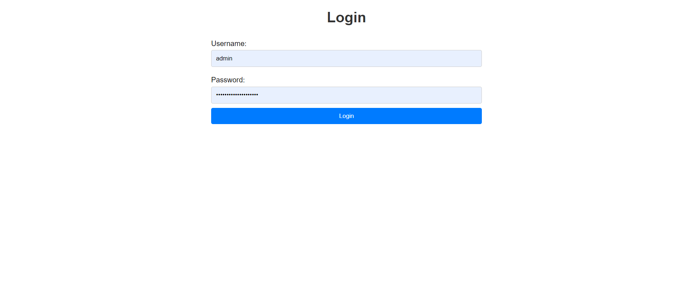
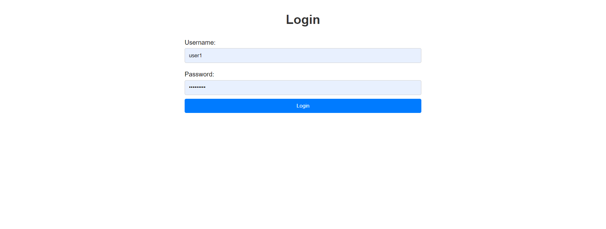

### Admin Dashboard
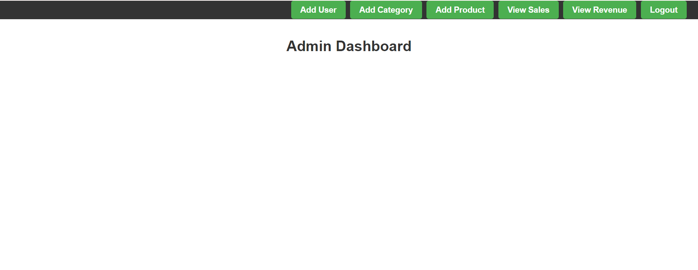

### Add User
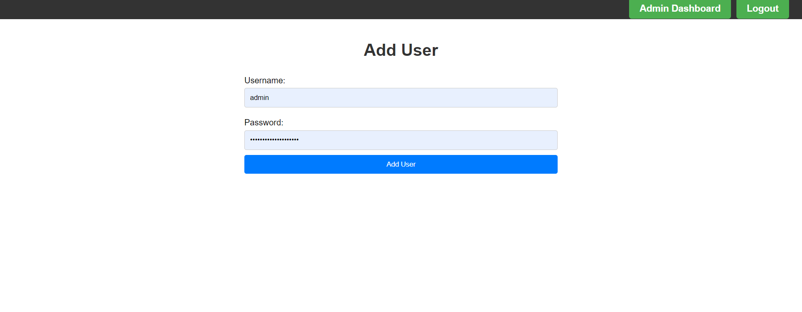

### Add Category
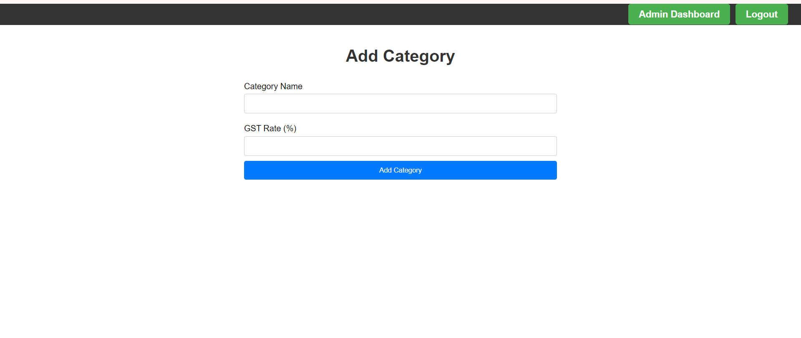

### Add Product
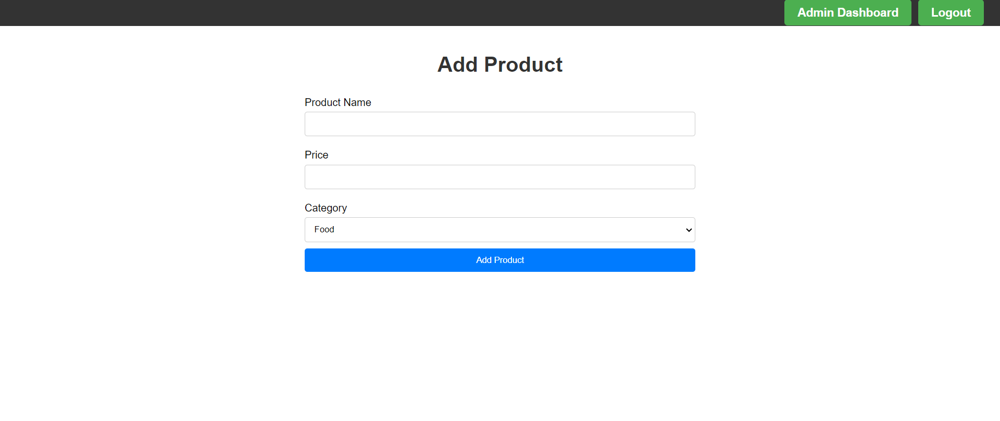

### View Sales
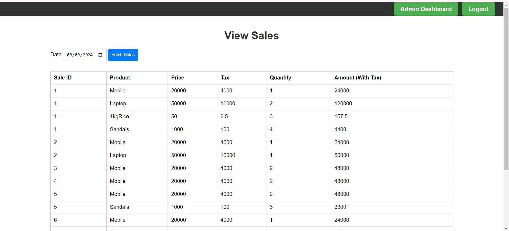

### View Revenue
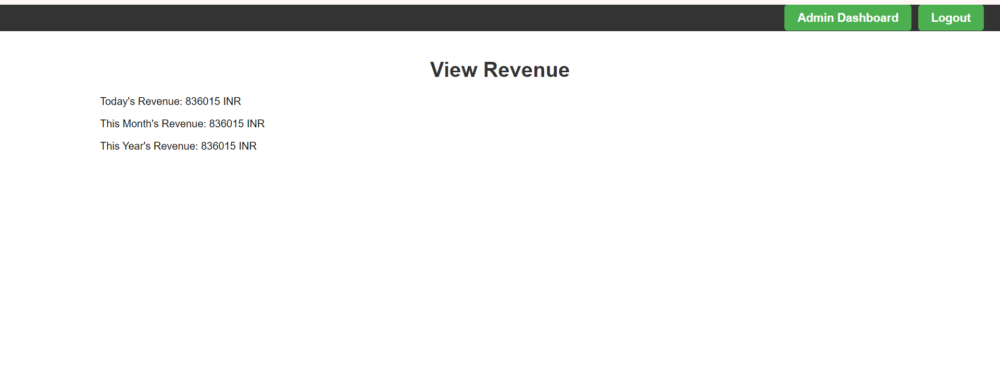

### User Dashboard
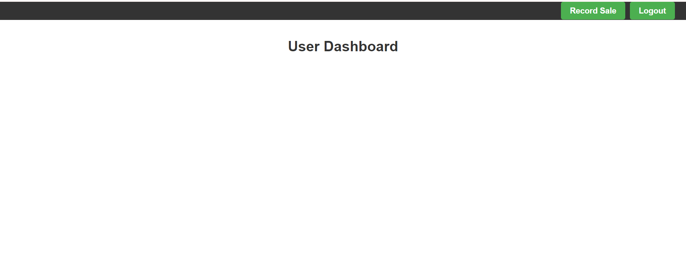

### Record Sale
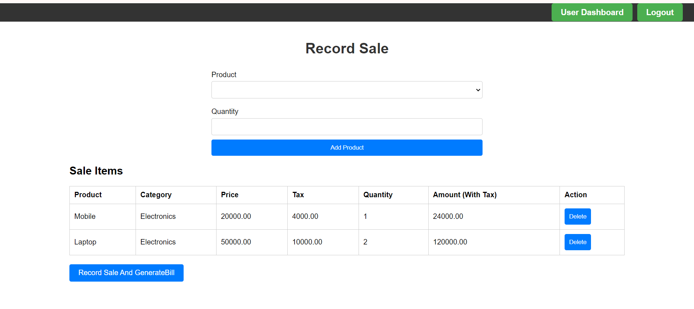

### View Bill
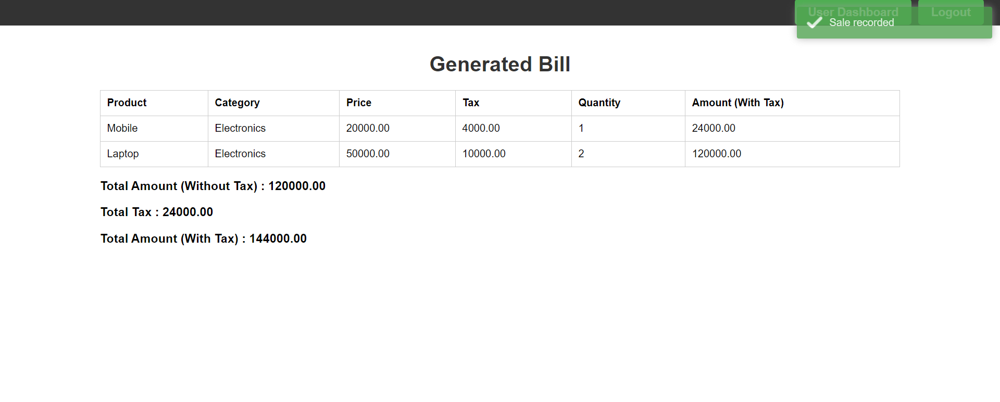

### Logging out

